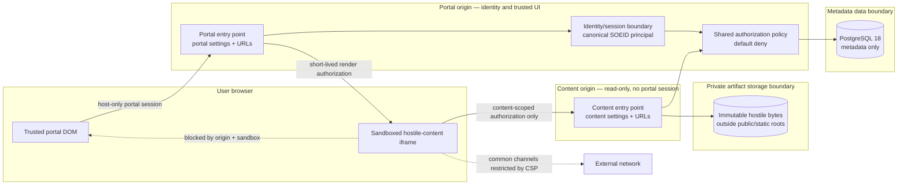

# Foundation architecture and trust boundaries

Agora is one modular Django application with two least-privilege web entry points. It does not
launch a process or container per Dashboard. Portal and content may share an application
package, policy layer, PostgreSQL metadata database, and private storage adapter, but they do
not share browser trust, URL configuration, or middleware.

## Boundary diagram



The rendered edge is implemented for exact owner previews and pinned published views. It never
returns uploaded bytes through the portal process.

## Local-development topology

| Surface | URL | Process | Trust |
|---|---|---|---|
| Portal | `https://localhost:8443` | `scripts/run_https.py` → `agora.settings.portal` | Trusted UI; host-only secure cookies. |
| Content | `https://127.0.0.1:8444` | `scripts/run_content_https.py` → `agora.settings.content` | Untrusted/read-only; exact authorized routes plus catch-all 404. |
| PostgreSQL | `127.0.0.1:5432` | Compose `postgres` service | Metadata boundary; not browser-accessible. |
| Artifacts | absolute `AGORA_ARTIFACT_ROOT` | AG-002 private filesystem adapter | Opaque generated keys only; never a static/media root or raw URL. |

Both URLs terminate on loopback but use different browser hostnames deliberately. Ports alone do
not isolate cookies, and SameSite is not an origin boundary. Local TLS terminates for both entry
points using ignored development material. Production validation
requires distinct HTTPS origins, and operations must place them on different registrable sites
where firm DNS permits.

## Trust-boundary rules

| Boundary | Trusted inputs | Hostile inputs | Non-negotiable rule |
|---|---|---|---|
| Portal | Validated configuration and authenticated principal | All browser input and uploaded bytes | Never return uploaded HTML, mark it safe, insert it into DOM/`srcdoc`, or create same-origin `blob:`/`data:` documents from it. |
| Identity | Administrator-provisioned canonical User record | Login fields, form SOEIDs, identity-like headers | Normalize once; application policies consume an immutable authenticated principal, never a request-selected identity. |
| Policy/data | Constrained internal identifiers and database constraints | Route IDs, filenames, publication/Grant claims | Authorize before resolving metadata or artifacts; opaque IDs add no authority. |
| Content | Exact portal origin and content-scoped render authorization | Uploaded HTML/CSV and every request parameter | GET/HEAD-only artifact gateway, no portal sessions, mutations, templates, administration, or general APIs. |
| Storage | Generated internal keys and adapter-owned absolute root | User filenames and artifact bytes | Storage keys never derive from filenames; artifacts remain outside public/static roots and are accessible only through metadata plus policy. |

Hostile Revisions must not share ambient credentials or durable browser storage. The AG-007
baseline therefore uses an opaque sandboxed origin. Any proposal to grant `allow-same-origin`
must first provide per-Dashboard/per-Revision origin isolation or an independently reviewed
equivalent. CSP is defense in depth, not a complete browser network firewall; AG-007 owns
supported-browser tests and any additional egress controls required by the deployment.

The source tree encodes the split with distinct settings, URLconfs, ASGI/WSGI applications, and
middleware. Both compositions load the shared persistence models, but the content composition
has no sessions, templates, mutation routes, or portal middleware. Its exact renderer routes are
GET/HEAD-only and every unmatched path returns 404 with a default-deny CSP. The portal host
allowlist excludes the content hostname.

Portal-issued render credentials are 256-bit random values stored only as SHA-256 digests. They
expire after five minutes and bind viewer, current authentication version, Dashboard, Revision,
audience, and current authorization state. The content process rechecks expiry, revocation,
active-user state, ownership or Viewer Grant, publication pointer, and artifact scope for every
HTML and CSV request. The local content launcher disables access logging because the short-lived
bearer appears in the iframe path; production proxies must apply equivalent path redaction.
Because `sandbox="allow-scripts"` gives uploaded HTML an opaque origin, only an already-authorized
CSV response may opt into the exact `Access-Control-Allow-Origin: null` value. It also varies on
`Origin`, never enables credentials or a wildcard, and grants nothing to HTML, failures, or
non-null origins.

## Module ownership

```text
src/agora/config.py          typed shared startup contract
src/agora/settings/base.py   non-browser shared settings
src/agora/settings/portal.py trusted portal composition
src/agora/settings/content.py isolated content composition
src/agora/urls/portal.py     trusted UI/API routes only
src/agora/urls/content.py    exact authorized HTML/CSV routes plus catch-all 404
src/agora/rendering/         render authorization, delivery, CSP, and sandbox policy
src/agora/portal/            trusted project, upload, preview, identity, and admin UI
src/agora/persistence/       constrained metadata, domain services, migrations, private storage
```

Future domain code belongs behind a shared policy/service layer rather than in views. Portal
and content may call the same policy functions, but content must not import portal views,
session middleware, or templates.

AG-002 coordinates PostgreSQL and the filesystem through durable `StorageReservation` rows.
Artifact bytes are streamed, fsynced, read-back verified, and installed without clobbering before
a short outermost metadata transaction exposes a complete Revision. A known rollback deletes
only bytes proven to belong to that attempt; compensation locks the reservation before resolving
an ambiguous commit, and a crash leaves a reservation that the bounded cleanup command can
reconcile. Durable reservation states distinguish verified ownership, collision preservation, and
an unwitnessed write outcome; the last is retained rather than guessed. The database and filesystem
are not presented as one impossible distributed transaction.

Dashboard rows retain `first_published_at` so restore can deterministically distinguish never-
published Drafts from previously Published Dashboards. Model guards and PostgreSQL triggers enforce
the lifecycle transition graph, terminal Deleted/read-only Archived behavior, active-owner
Revision creation, same-Dashboard publication/latest pointers, and complete immutable Revision
sets. Later tickets add the user-facing lifecycle and publication workflows; AG-002 provides their
durable boundary only.

## Runtime and stack

| Concern | Selected baseline | Support policy |
|---|---|---|
| Language | CPython 3.14.7 | Exactly pinned for development/CI; application supports latest `3.14.x`, through `<3.15`. Python 3.14 is in bugfix support through 2030-10. |
| Backend/UI | Django 5.2.17 LTS with server-rendered templates and committed CSS | `>=5.2.17,<5.3`, exact transitive resolution in `uv.lock`; security support through 2028-04. |
| Metadata DB | PostgreSQL 18.6 + Psycopg 3.3 | PostgreSQL 18 major, current minor upgrades; no SQLite substitute. Major support ends 2030-11. |
| Migrations | Django ORM migrations | Schema changes require checked-in forward migrations and explicit reversal/rollback consideration. |
| Dependencies | uv 0.12.6 universal lock | `uv.lock` is committed; CI uses `--locked` and `uv lock --check`. |
| Static quality | Ruff 0.16, mypy 2 + django-stubs | Format, lint, and strict type checks are blocking. Runtime tests compensate for stub/framework version skew. |
| Tests | pytest 9, pytest-django, pytest-cov | Branch coverage is blocking; PostgreSQL connection and both service boundaries have smoke coverage. |
| CI | GitHub Actions | Read-only token, SHA-pinned actions, locked install, PostgreSQL service, full quality gate, bounded timeout. |

No Node runtime, SPA framework, bundler, task queue, cache, object store, or microservice split is
justified by AG-001. Browser test engines arrive with the renderer workflow rather than as idle
dependencies.

## Primary technical references

- [Python version status](https://devguide.python.org/versions/)
- [Python 3.14.7 release line](https://www.python.org/doc/versions/)
- [Django 5.2 LTS release notes](https://docs.djangoproject.com/en/5.2/releases/5.2/)
- [Django supported versions](https://www.djangoproject.com/download/)
- [Django database support](https://docs.djangoproject.com/en/5.2/ref/databases/)
- [Django migrations](https://docs.djangoproject.com/en/5.2/topics/migrations/)
- [PostgreSQL versioning policy](https://www.postgresql.org/support/versioning/)
- [uv project locking](https://docs.astral.sh/uv/concepts/projects/sync/)
- [GitHub Actions secure use](https://docs.github.com/en/actions/security-guides/security-hardening-for-github-actions)
- [RFC 6454 web origin model](https://www.rfc-editor.org/rfc/rfc6454)
- [Django user-uploaded content guidance](https://docs.djangoproject.com/en/5.2/topics/security/#user-uploaded-content)

ECS topology, production high availability, reverse-proxy SSO, and production packaging remain
explicitly out of scope.
